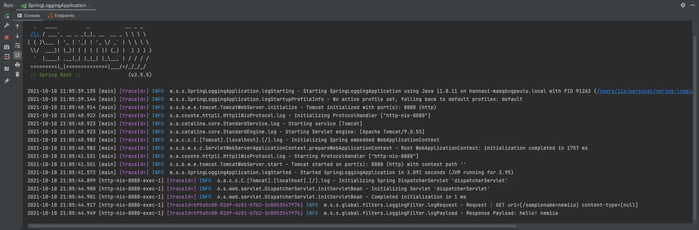

# Spring Logging
### 1. Logging HTTP Request/Response
- Logging HTTP Request Method, URI, Query String, Content type and Payload
- Logging HTTP Response
- Add Trace Id (for each HTTP Request)
- See commit [48e0d37a](https://github.com/HyunAh-iia/spring-logging/commit/48e0d37a36ce362b7d44ed11dceb1d4e71b8dea7)
###2. Send Logs to AWS CloudWatch if Active Profile is dev, prod
- If Active profile is dev or prod, Send logs to CloudWatch
- If not, Print Console Log
- See commit [144d71f0](https://github.com/HyunAh-iia/spring-logging/commit/144d71f01a9f170e1186f5c9905ad6e90082d7cf)
### Test
- Run SpringLoggingApplication
- Call Sample API
```
curl "http://localhost:8080/sample?name=newiia"
```
- Result : Console Log
```
2021-10-10 21:05:44.917 [http-nio-8080-exec-1] [traceId=bf5a5c08-02df-4c01-b7b2-3c8053547f7b] INFO  m.s.s.global.filters.LoggingFilter.logRequest - Request : GET uri=[/samplename=newiia] content-type=[null]
2021-10-10 21:05:44.949 [http-nio-8080-exec-1] [traceId=bf5a5c08-02df-4c01-b7b2-3c8053547f7b] INFO  m.s.s.global.filters.LoggingFilter.logPayload - Response Payload: hello! newiia
```
